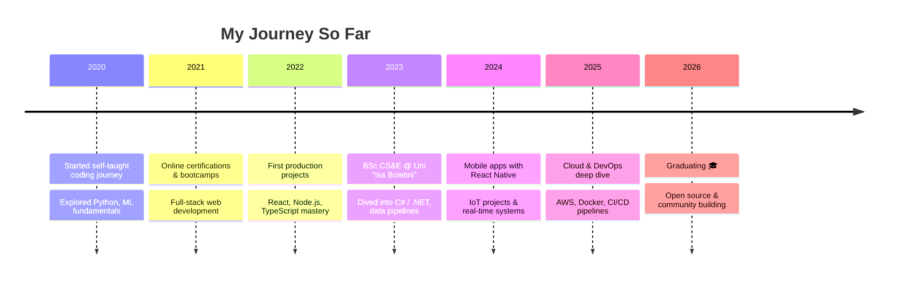

<p align="center">
  
</p>

<p align="center">
  <a href="https://nor1t.vercel.app/"></a>
  <a href="https://www.linkedin.com/in/noriti/"></a>
  <a href="https://twitter.com/NoritQy"></a>
  <a href="https://www.instagram.com/norit_qyqalla/"></a>
  <a href="mailto:qnorit@gmail.com"></a>
</p>

<br />


```typescript
// norit.config.ts
const NORIT = {
  location  : "Kosovo 🇽🇰",
  role      : "Full-Stack Engineer",
  education : "BSc Computer Science & Engineering",
  interests : ["Web Dev", "Mobile Apps", "Data Engineering", "ML"],
  currently : "Building cool stuff & exploring cloud-native",
  funFact   : "I treat semicolons like breathing — automatic.",
};

if (you.hasCoolProject()) NORIT.collaborate();
```

<br clear="right"/>

---

##  Tech DNA

<table align="center">
<tr>
<td align="center" width="96">
  
  <br /><strong>React</strong>
</td>
<td align="center" width="96">
  
  <br /><strong>TypeScript</strong>
</td>
<td align="center" width="96">
  
  <br /><strong>JavaScript</strong>
</td>
<td align="center" width="96">
  
  <br /><strong>Python</strong>
</td>
<td align="center" width="96">
  
  <br /><strong>C#</strong>
</td>
<td align="center" width="96">
  
  <br /><strong>Node.js</strong>
</td>
<td align="center" width="96">
  
  <br /><strong>Docker</strong>
</td>
<td align="center" width="96">
  
  <br /><strong>AWS</strong>
</td>
<td align="center" width="96">
  
  <br /><strong>GitHub</strong>
</td>
</tr>
</table>

###  What I Work With

|  Frontend |  Backend |  Database |  DevOps & Tools |
|-------------|------------|-------------|-------------------|
| React | Node.js | PostgreSQL | Docker |
| React Native | Express | MongoDB | GitHub Actions |
| Next.js | FastAPI | Supabase | AWS |
| Tailwind CSS | PHP | Firebase | Vite |
| HTML5 / CSS3 | C# / .NET | SQL Server | Git |

###  Skills Breakdown

```
React / React Native  ████████████████████░  94%
TypeScript            ██████████████████░░░  90%
JavaScript            ███████████████████░░  95%
Python                █████████████████░░░░  88%
C# / .NET             ████████████████░░░░░  82%
SQL                   █████████████████░░░░  85%
PySpark               ████████████████░░░░░  80%
Machine Learning      ██████████████████░░░  92%
Git                   ██████████████████░░░  93%
```

---

##  Featured Projects

<p align="center">
  <a href="https://github.com/nor1t/KosVibe">
    
  </a>
  <a href="https://github.com/nor1t/LFGconnect">
    
  </a>
  <a href="https://github.com/nor1t/SEMAFORI">
    
  </a>
  <a href="https://github.com/nor1t/smartBINS">
    
  </a>
</p>

<p align="center">
  <a href="https://github.com/nor1t?tab=repositories">
    
  </a>
</p>

---

##  GitHub Activity

<p align="center">
  
  
</p>

<p align="center">
  
</p>

---

##  Education & Journey



>  **University "Isa Boletini" in Mitrovica** — BSc in Computer Science & Engineering *(2023 – 2026)*
>
>  **Online Certifications & Bootcamps** — Full-Stack & Data Engineering Track *(2021 – 2026)*
>
>  **Self-Directed Learning** — Machine Learning & Applied AI *(2020 – Present)*

---

##⚡ Quick Stats

<p align="center">
  
  
  
</p>

```
   ⚡ Years Coding: 3+          💻 Projects: 15+
   📄 Lines Shipped: 100k+      🔓 Open Source: 12 repos
```

---

##  Let's Connect

<p align="center">
  <i>I'm always open to collaborating on interesting projects, contributing to open source,</i><br/>
  <i>or just chatting about tech. Don't hesitate to reach out!</i>
</p>

<p align="center">
  <a href="https://nor1t.vercel.app/">
    
  </a>
  <a href="https://www.linkedin.com/in/noriti/">
    
  </a>
  <a href="https://twitter.com/NoritQy">
    
  </a>
  <a href="https://www.instagram.com/norit_qyqalla/">
    
  </a>
</p>

---

<p align="center">
  
</p>

<p align="center">
  <sub>Built with ☕ and way too many all-nighters — © 2026 Norit Qyqalla</sub>
</p>
